<!--
  HackMD 自訂字體（GitHub 會自動忽略此區塊，不影響顯示）
-->
<style>
@import url('https://fonts.googleapis.com/css2?family=LXGW+WenKai+TC&display=swap');

.markdown-body {
  font-family: 'LXGW WenKai TC', sans-serif;
}
code, pre {
  font-family: 'Maple Mono', 'Fira Code', monospace;
}
</style>

# n8n 免費雲端部署：HuggingFace Spaces + Supabase PostgreSQL

> 零成本將 n8n 工作流程自動化平台部署到雲端，隨時隨地存取你的自動化工作流程。

## 架構總覽

| 元件 | 服務 | 免費額度 |
|------|------|----------|
| n8n 應用程式 | HuggingFace Spaces (Docker) | 2 vCPU / 16GB RAM / 50GB Disk |
| 資料庫 | Supabase PostgreSQL | 500MB / 50,000 rows |

> **為什麼需要外部資料庫？** HuggingFace Spaces 閒置一段時間後會自動休眠，內建儲存會被清除。使用 Supabase 外部資料庫，才能確保你的工作流程資料不會遺失。

---

## 步驟一：申辦帳號

開始之前，先註冊以下兩個免費服務的帳號：

### HuggingFace

1. 前往 [huggingface.co/join](https://huggingface.co/join)
2. 可用 **GitHub 登入**（最快）或 Email 註冊
3. 記住你的**使用者名稱**，之後產生 n8n 網址會用到

### Supabase

1. 前往 [supabase.com/dashboard/sign-up](https://supabase.com/dashboard/sign-up)
2. 建議用 **GitHub 登入**，方便管理

---

## 步驟二：建立 Supabase 資料庫

### 1. 建立 Organization 與新專案

登入 Supabase 後，先建立一個 Organization（組織）來管理你的專案，接著點擊右上角 **+ New project**。

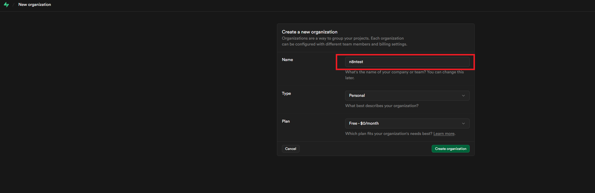

### 2. 設定專案資訊

填寫以下欄位：

| 欄位 | 填寫內容 | 說明 |
|------|----------|------|
| **Organization** | 選擇剛建立的 Organization | 免費方案即可 |
| **Project name** | `n8n` | 自訂專案名稱 |
| **Database password** | 自訂強密碼 | ⚠️ **請務必記下來！** 後續設定 HuggingFace 會用到 |
| **Region** | `Asia-Pacific` | 選擇離你最近的區域 |

> **重要：** Database password 請點擊 **Copy** 複製，貼到安全的地方保存。這組密碼稍後設定 HuggingFace 環境變數時會用到，遺失的話需要重新設定。

Security 的部分維持預設即可，最後點擊 **Create new project**。

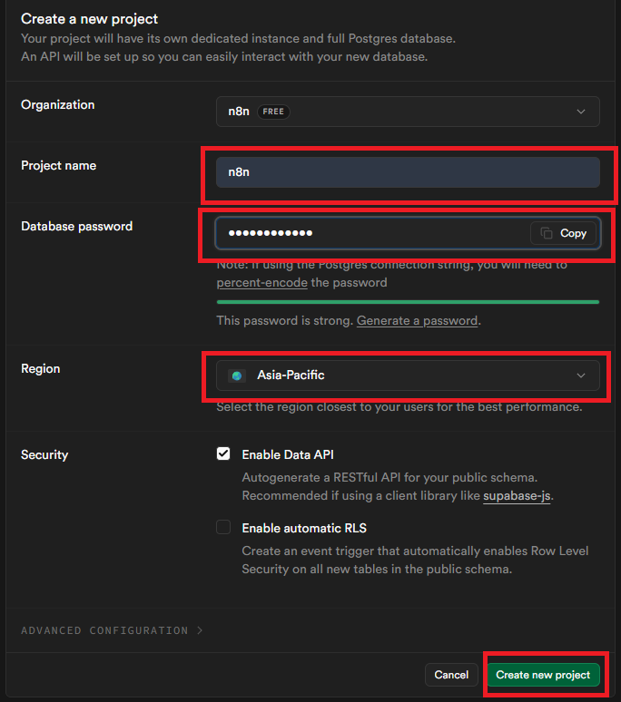

---

## 步驟三：取得 Supabase 連線資訊

### 1. 點擊 Connect

專案建立完成後，點擊頂部導覽列右上角的 **Connect** 按鈕。


### 2. 取得連線參數

在 **Connect to your project** 面板中：

1. **Type** 選擇 `SQLAlchemy`
2. **Method** 選擇 `Transaction pooler`
3. 往下找到第 3 區塊 **Connect to your database**，記下連線參數

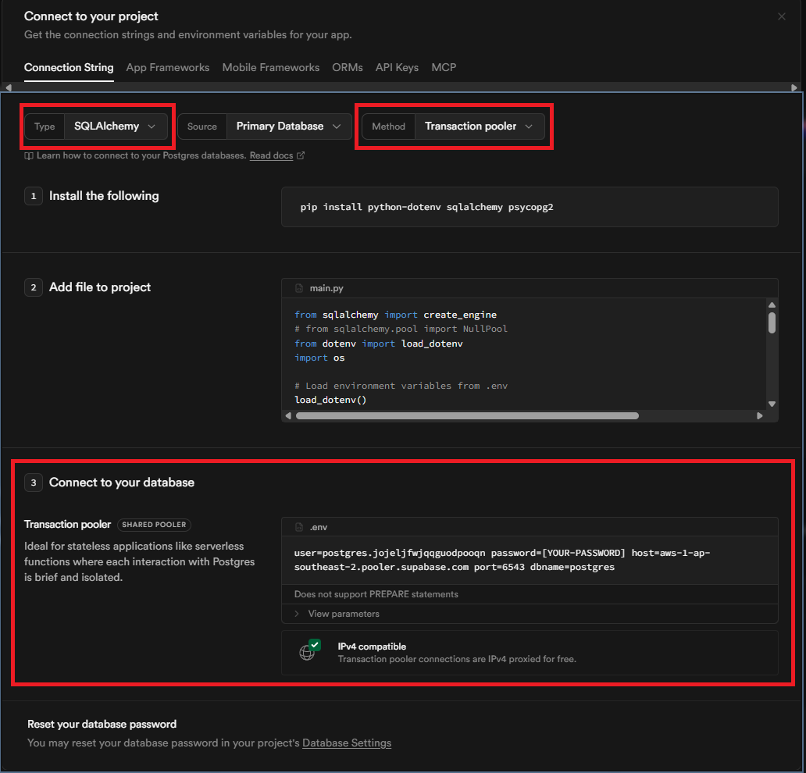

從連線字串中擷取以下資訊，稍後設定 HuggingFace 會用到：

| 參數 | 範例值 | 說明 |
|------|--------|------|
| **user** | `postgres.xxxxxxxx` | 使用者名稱 |
| **password** | 步驟二設定的密碼 | 將 `[YOUR-PASSWORD]` 替換為你的密碼 |
| **host** | `aws-1-ap-southeast-2.pooler.supabase.com` | 主機位址 |
| **port** | `6543` | Transaction pooler 的 port |
| **dbname** | `postgres` | 資料庫名稱 |

> **提示：** 點擊 **View parameters** 可以更清楚地檢視各個參數。

---

## 步驟四：產生加密金鑰

n8n 需要一組加密金鑰來保護你儲存的 credentials。在終端機執行：

```bash
openssl rand -base64 32
```

把產生的字串記下來，稍後填入 HuggingFace 的環境變數。

> 沒有 openssl？也可以用 [隨機密碼產生器](https://www.random.org/strings/) 產生一組 32 字元以上的隨機字串。

---

## 步驟五：部署到 HuggingFace Spaces

### 1. 搜尋 n8n 模板

1. 登入 HuggingFace，點擊頂部導覽列的 **Spaces**
2. 搜尋欄輸入 `n8n`
3. 排序選擇 **Sort: Most likes**
4. 找到 **baoyin2024** 的 **N8n** 空間（likes 最多），點進去

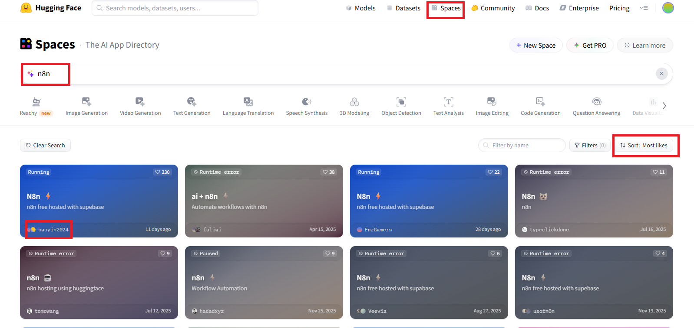

### 2. Duplicate this Space

進入 baoyin2024 的 N8n 空間後，點擊右上角 **⋮** 選單，選擇 **Duplicate this Space**。

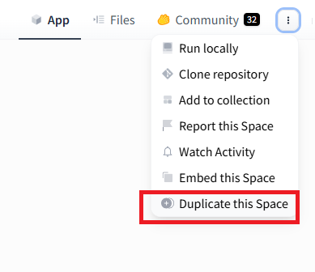

### 3. 設定環境變數

Duplicate 視窗會帶入模板的預設值，**紅框處為你需要修改的欄位**：

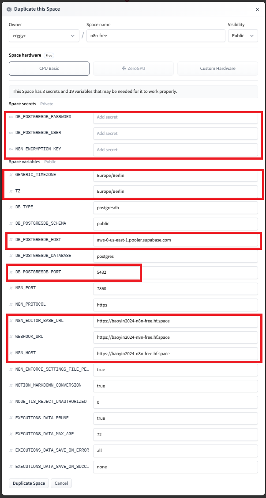

以下是填寫完成的對照圖。上方為 Supabase 的連線字串，紅框處為對應填入的值：

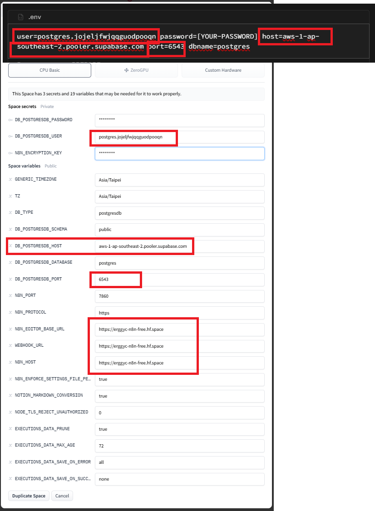

#### 基本設定

| 欄位 | 填寫內容 |
|------|----------|
| **Owner** | 你的 HuggingFace 帳號 |
| **Space name** | `n8n-free`（或自訂名稱） |
| **Visibility** | `Public` |
| **Space hardware** | `Free` |

#### Space Secrets（私密，需修改）

| 變數 | 修改為 | 說明 |
|------|--------|------|
| `DB_POSTGRESDB_PASSWORD` | 你的 Supabase 密碼 | 步驟二設定的 Database password |
| `DB_POSTGRESDB_USER` | 你的 Supabase user | 步驟三取得的 user（如 `postgres.xxxxxxxx`） |
| `N8N_ENCRYPTION_KEY` | 步驟四產生的加密金鑰 | **不要用預設的 `n8n`** |

#### Space Variables（公開，需修改）

以下列出**需要修改**的變數，其餘維持預設即可：

| 變數 | 修改為 | 說明 |
|------|--------|------|
| `GENERIC_TIMEZONE` | `Asia/Taipei` | 時區 |
| `TZ` | `Asia/Taipei` | 系統時區 |
| `DB_POSTGRESDB_HOST` | 你的 Supabase host | 步驟三取得的 host |
| `DB_POSTGRESDB_PORT` | `6543` | ⚠️ 預設 `5432` 要改成 `6543` |
| `N8N_EDITOR_BASE_URL` | `https://<你的帳號>-n8n-free.hf.space` | 替換為你的帳號 |
| `WEBHOOK_URL` | `https://<你的帳號>-n8n-free.hf.space` | 同上 |
| `N8N_HOST` | `https://<你的帳號>-n8n-free.hf.space` | 同上 |

> ⚠️ **常見錯誤：**
> - `N8N_ENCRYPTION_KEY` 預設是 `n8n`，**一定要改成強密碼**，否則 credentials 容易被破解
> - `DB_POSTGRESDB_PORT` 預設是 `5432`，要改成 **`6543`**（Transaction pooler）
> - 三個網址（`N8N_EDITOR_BASE_URL`、`WEBHOOK_URL`、`N8N_HOST`）都要改成你自己的帳號

#### 其他變數（維持預設即可）

| 變數 | 預設值 | 說明 |
|------|--------|------|
| `DB_TYPE` | `postgresdb` | 資料庫類型 |
| `DB_POSTGRESDB_SCHEMA` | `public` | Schema |
| `DB_POSTGRESDB_DATABASE` | `postgres` | 資料庫名稱 |
| `N8N_PORT` | `7860` | HuggingFace 要求的 port |
| `N8N_PROTOCOL` | `https` | 協定 |
| `N8N_ENFORCE_SETTINGS_FILE_PERMISSIONS` | `true` | 安全設定 |
| `EXECUTIONS_DATA_PRUNE` | `true` | 自動清理執行記錄 |
| `EXECUTIONS_DATA_MAX_AGE` | `72` | 保留 72 小時 |
| `EXECUTIONS_DATA_SAVE_ON_ERROR` | `all` | 錯誤時保存 |
| `EXECUTIONS_DATA_SAVE_ON_SUCCESS` | `none` | 成功時不保存（節省空間） |

全部設定完成後，點擊 **Duplicate Space** 開始部署。

### 4. 等待部署完成

部署後點擊上方的 **Logs** 頁籤，選擇 **Container** 查看編譯過程。

第一次編譯需要一段時間，請耐心等待。當 Logs 出現以下訊息，代表部署成功：

```
Editor is now accessible via:
https://<你的帳號>-n8n-free.hf.space
```

> ⚠️ **重要：** 這個網址才是正確的 n8n 登入網址。請直接在瀏覽器開啟，不要透過 HuggingFace 的內嵌畫面操作（iframe 會被 n8n 的安全機制阻擋）。

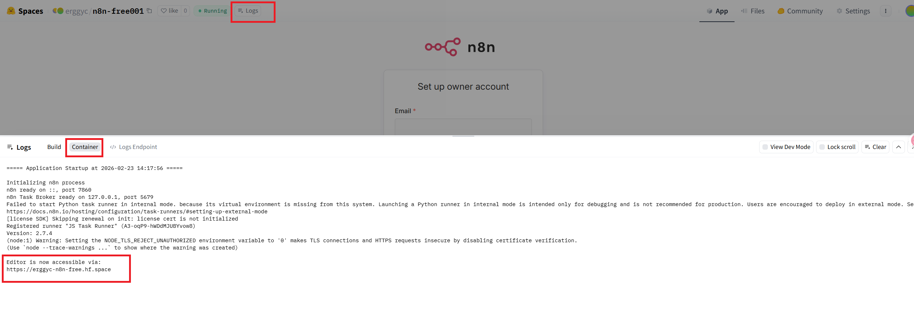

---

## 步驟六：設定 n8n 管理員帳號

### 1. 建立帳號

在瀏覽器開啟 `https://<你的帳號>-n8n-free.hf.space`，會看到 **Set up owner account** 畫面：

| 欄位 | 說明 |
|------|------|
| **Email** | ⚠️ 請填**可收信的 Email**，後續需要用來接收 License Key |
| **First Name** | 名字 |
| **Last Name** | 姓氏 |
| **Password** | 8 字元以上，至少 1 個數字和 1 個大寫字母 |

填寫完成後點擊 **Next**。

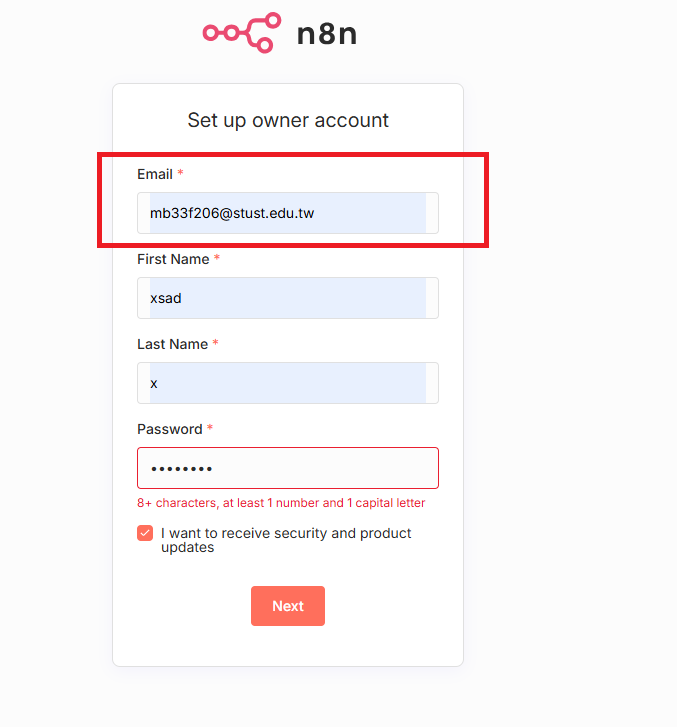

### 2. 填寫問卷

接下來會有一份簡單的使用問卷，依個人情況填寫即可。

### 3. 申請免費 License Key

問卷結束後會出現 **Get paid features for free (forever)** 畫面，可免費解鎖以下進階功能：

- **Advanced debugging** — 偵錯並重新執行錯誤的工作流程
- **Execution search and tagging** — 搜尋與整理歷史執行記錄
- **Folders** — 用資料夾分類管理工作流程

輸入你的 Email，點擊 **Send me a free license key**。也可以點 Skip 跳過，之後再設定。

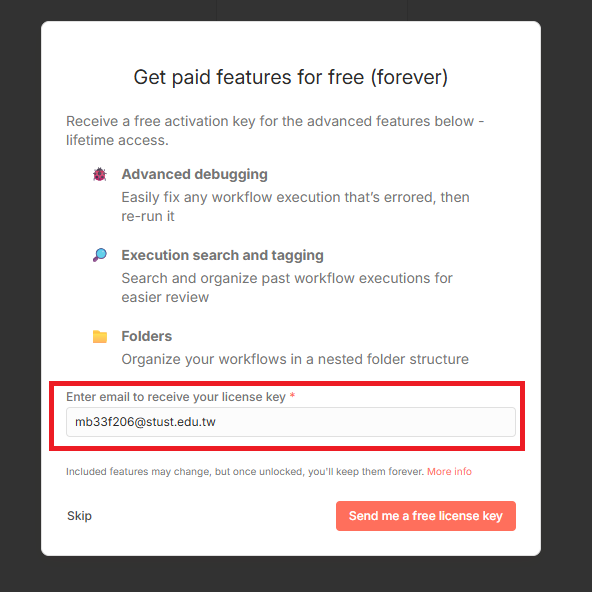

### 4. 啟用 License Key

點擊送出後，右下角會彈出通知，點擊 **usage and plan** 前往啟用頁面。

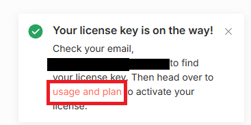

接著到信箱找到 n8n.io 寄來的信件，複製 **Your license key**。

> 如果錯過了右下角通知，也可以從 **Settings → Usage and plan → Enter activation key** 進入。License key 有 **14 天**的啟用期限，記得儘早啟用。

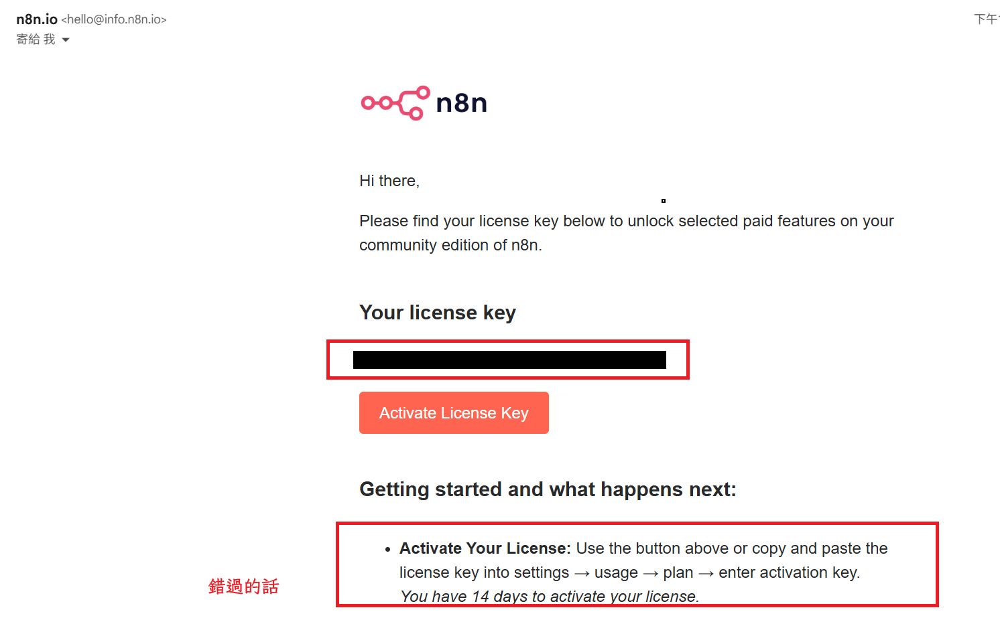

回到 n8n 的 **Usage and plan** 頁面，點擊 **Enter activation key**，貼上剛才複製的 key，點擊 **Activate** 完成啟用。

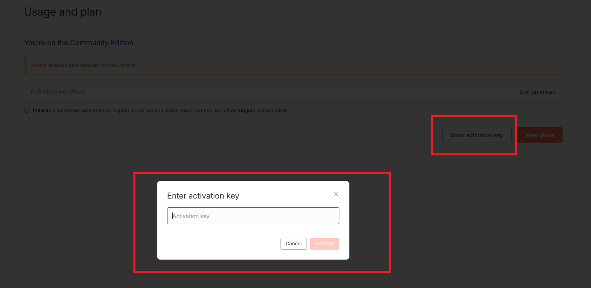

---

## 步驟七：開始使用 n8n

啟用完成後，回到首頁就可以建立你的第一個工作流程了！

> **關於效能：** 由於是部署在 HuggingFace 免費方案上，操作時會有些卡頓，這是正常現象。如果只是用在 Email 收發之類的簡易工作流，這個方案已經足夠使用。
>
> 若需要更好的效能，也可以考慮自建伺服器。站長 **@harry123180** 有自建小型樹莓派伺服器的教學，有興趣歡迎找他聊聊。

---

## 注意事項

### 休眠機制

HuggingFace Spaces 免費方案閒置約 48 小時後會自動休眠。喚醒方式：

- 直接訪問你的 Space 網址
- 到 HuggingFace Space 頁面點擊 **Restart**

> **小技巧：** 可以使用 [UptimeRobot](https://uptimerobot.com/) 等免費監控服務，定時 ping 你的 Space 網址來防止休眠。

### 安全性建議

- `N8N_ENCRYPTION_KEY` 設定後**不要更改**，否則已儲存的 credentials 會無法解密
- 建議設定強密碼作為 n8n 管理員帳號

### 免費額度限制

| 服務 | 限制 |
|------|------|
| HuggingFace Spaces | 2 vCPU、16GB RAM、50GB 暫存磁碟 |
| Supabase | 500MB 資料庫、50,000 rows、500MB 頻寬/月 |

對於個人使用和小型自動化專案，這些額度通常綽綽有餘。

---

## 相關資源

- [n8n 官方文件](https://docs.n8n.io/)
- [HuggingFace Spaces 文件](https://huggingface.co/docs/hub/spaces-overview)
- [Supabase 文件](https://supabase.com/docs)
- [baoyin2024/n8n Space 模板](https://huggingface.co/spaces/baoyin2024/n8n-free)
